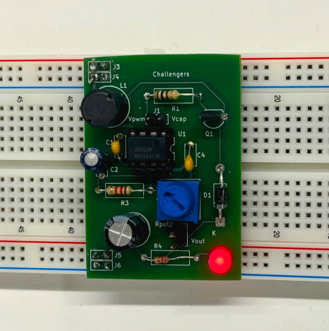
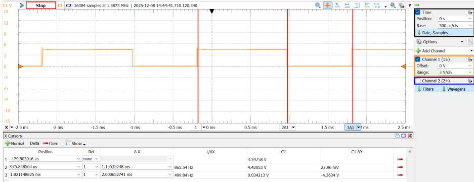
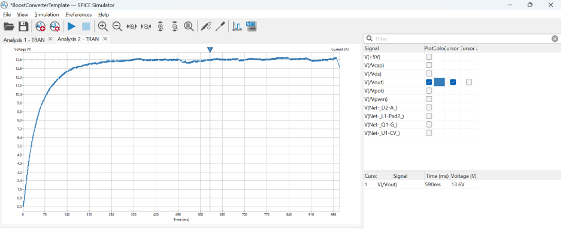
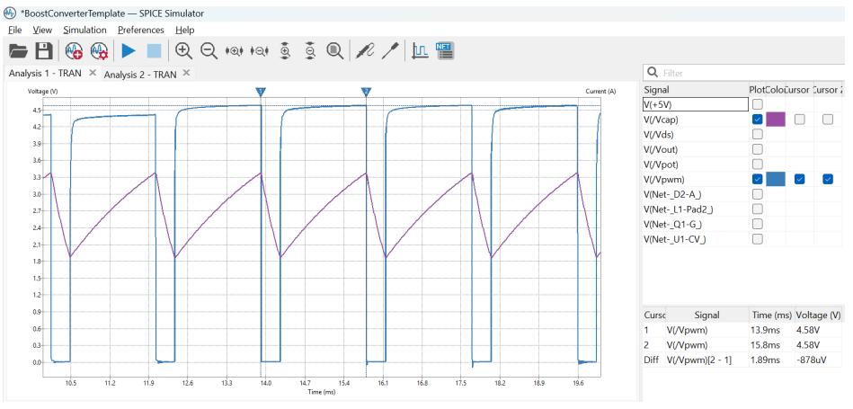

# Boost Converter (PCB + PWM)

Final report and documentation for a DC–DC boost converter project.

## Overview
- Designed a PWM-controlled boost converter and validated performance through simulation and lab measurement.
- Tools: KiCad (schematic/PCB), oscilloscope & bench measurements.

## Results (high level)
- Target: ~12 V output
- Key measurements and plots are included in the final report.

## Files
- **Final report:** `docs/boost-converter-final-report.pdf`
- **Images:** `images/` (PCB photo, scope captures, KiCad plots)

## Team
Kasie Nguyen • Christine Han • Eva Woodcock

## Gallery

